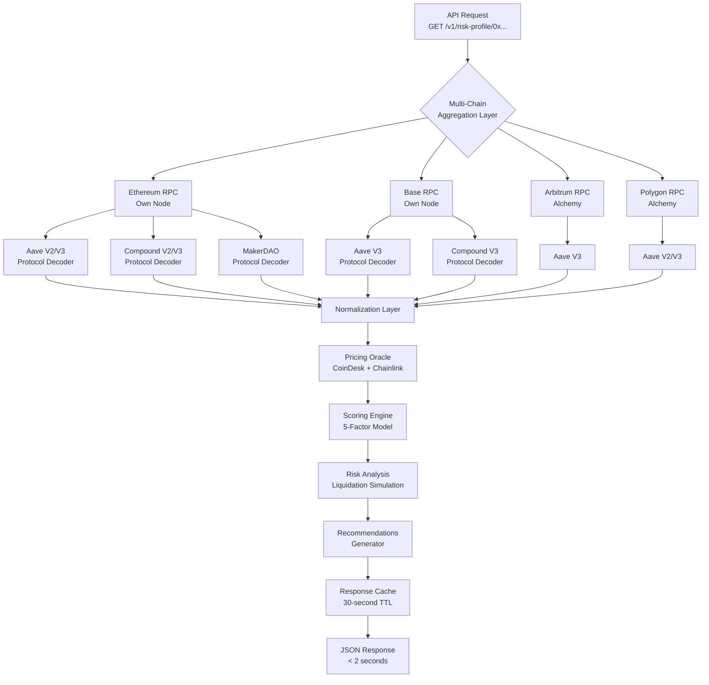

# Kixago DeFi Credit Intelligence Platform

**The Credit Bureau for Decentralized Finance**

---

## Executive Summary

Kixago is **the first real-time credit intelligence platform for crypto-native borrowers**. We provide FICO-style credit scores (300-850 range), liquidation risk analysis, and actionable recommendations based on a wallet's complete DeFi lending history across all protocols and chains.

### The Opportunity

**$50B+** in DeFi lending positions exist today, yet:
- ❌ Banks **cannot underwrite** crypto-native borrowers
- ❌ Wealth advisors **cannot verify** client DeFi holdings
- ❌ Developers spend **2-3 weeks** integrating each protocol
- ❌ Traders **miss liquidation opportunities** due to fragmented data

### Our Solution

**One API call** returns:
- ✅ **DeFi Credit Score** (300-850, like FICO)
- ✅ **Complete position data** across Aave, Compound, MakerDAO
- ✅ **Multi-chain aggregation** (Ethereum, Base, Arbitrum, Polygon)
- ✅ **Risk factor analysis** with severity levels
- ✅ **Liquidation scenarios** (what-if price drop modeling)
- ✅ **Actionable recommendations** (immediate, short-term, long-term)

**Response time:** 1-2 seconds  
**Developer integration time:** 5 minutes

---

## The Problem: The DeFi Credit Invisibility Gap

### Traditional Finance Has Credit Bureaus

When a borrower applies for a loan, lenders check:
- **FICO Score** (300-850 range)
- **Credit History** (bankruptcies, late payments)
- **Debt-to-Income Ratio**
- **Report Time:** 3-5 days
- **Cost:** $30-50 per check

**Result:** Lenders can underwrite with confidence.

---

### DeFi Has NO Credit Bureau

When a crypto-native borrower seeks financing:
- ❌ No standardized credit score
- ❌ DeFi positions invisible to traditional finance
- ❌ No way to verify leverage or liquidation risk
- ❌ Manual analysis takes days (if possible at all)

**Result:** Banks decline crypto-native borrowers, even if they have $10M+ in DeFi collateral.

---

### The Data Fragmentation Problem

A single wallet might have positions across:

| Protocol | Chains | APIs Required |
|----------|--------|---------------|
| **Aave V2** | Ethereum, Polygon | 2 integrations |
| **Aave V3** | Ethereum, Base, Arbitrum, Polygon | 4 integrations |
| **Compound V2** | Ethereum | 1 integration |
| **Compound V3** | Ethereum, Base, Arbitrum, Polygon | 4 integrations |
| **MakerDAO** | Ethereum | 1 integration |
| **TOTAL** | — | **12 separate integrations** |

**Each integration requires:**
- Custom ABI decoding
- Chain-specific RPC calls
- Token price oracles
- Health factor calculations
- USD value normalization

**Time required:** 2-3 weeks per protocol × 5 protocols = **~3 months**

---

## Our Solution: DeFi Credit Intelligence API

Kixago provides **the credit bureau layer** for decentralized finance.

### Core Value Proposition

```http
GET /v1/risk-profile/0xWalletAddress
```

Returns in 1-2 seconds:

```json
{
  "defi_score": 467,
  "risk_level": "High Risk",
  "total_collateral_usd": 2200000000,
  "total_borrowed_usd": 1900000000,
  "global_health_factor": 1.067,
  "global_ltv": 89.02,
  
  "risk_factors": [
    {
      "severity": "critical",
      "factor": "Imminent Liquidation Risk",
      "description": "Health factor 1.067 means position will be liquidated if collateral value drops 6.7%"
    }
  ],
  
  "recommendations": {
    "immediate": [
      "URGENT: Deposit $387M more collateral OR repay debt to raise health factor above 1.5"
    ]
  },
  
  "liquidation_simulation": {
    "scenarios": [
      {
        "event": "Collateral drops 10%",
        "status": "LIQUIDATED",
        "estimated_loss": "$218M in liquidation penalties"
      }
    ]
  }
}
```

**No integration work. No multi-chain complexity. Just answers.**

---

## DeFi Credit Scoring Methodology

### The 5-Factor Scoring Model (300-850 Range)

Our proprietary scoring algorithm evaluates 5 weighted components:

| Component | Weight | What It Measures |
|-----------|--------|------------------|
| Health Factor | 40% | Proximity to liquidation |
| Leverage Ratio | 30% | Debt-to-collateral ratio (LTV) |
| Diversification | 15% | Concentration risk (assets & protocols) |
| Volatility Exposure | 10% | Collateral asset risk profile |
| Protocol Risk | 5% | Smart contract maturity |

**Formula:**

```
Internal Score (0-100) = Σ(Component Score × Weight)
Final Score = (Internal Score × 5.5) + 300
```

**Result:** FICO-style score between 300-850

---

### Component 1: Health Factor Score (40% Weight)

**What it measures:** How close a position is to liquidation.

| Health Factor | Score | Risk Level |
|--------------|-------|------------|
| ≥ 2.0 | 100 | Extremely safe |
| 1.5 - 2.0 | 80 | Safe |
| 1.3 - 1.5 | 60 | Moderate |
| 1.1 - 1.3 | 40 | Risky |
| 1.0 - 1.1 | 20 | DANGER ZONE |
| < 1.0 | 0 | Liquidated |

**Why 40% weight?** This is the single most important metric in DeFi lending. Below 1.0 = instant liquidation.

---

### Component 2: Leverage Score (30% Weight)

**What it measures:** Loan-to-value ratio (debt ÷ collateral).

| LTV Range | Score | Risk Level |
|-----------|-------|------------|
| 0-30% | 100 | Minimal leverage |
| 31-50% | 80 | Conservative |
| 51-70% | 60 | Moderate |
| 71-85% | 40 | Aggressive |
| 86-95% | 20 | Very aggressive |
| > 95% | 0 | Extreme danger |

**Example:** $1M collateral, $900K debt = 90% LTV = 20 points

---

### Component 3: Diversification Score (15% Weight)

**What it measures:** Concentration risk across assets and protocols.

**Sub-component A: Collateral Concentration (50 pts max)**

- Top asset < 40% of collateral: 50 points
- Top asset 40-60%: 35 points
- Top asset 60-80%: 20 points
- Top asset > 80%: 10 points

**Sub-component B: Protocol Diversification (50 pts max)**

- 3+ protocols: 50 points
- 2 protocols: 35 points
- 1 protocol: 20 points

**Example:** 100% weETH in Aave only = 30/100 (poor diversification)

---

### Component 4: Volatility Exposure Score (10% Weight)

**What it measures:** Risk from holding volatile collateral assets.

**Asset Risk Weights:**

- Stablecoins (USDC, DAI): 1.0x (safest)
- Blue chips (ETH, WBTC): 0.8x (low risk)
- Large caps (AAVE, UNI, LINK): 0.6x (medium risk)
- Liquid staking (weETH, wstETH): 0.5x (higher risk)
- Long-tail assets: 0.3x (highest risk)

**Calculation:**

```
Score = (Σ(Asset USD Value × Risk Weight) / Total Collateral) × 100
```

**Example:** $2.2B in weETH (0.5x weight) = 50/100

---

### Component 5: Protocol Risk Score (5% Weight)

**What it measures:** Smart contract and protocol maturity risk.

| Protocol | Version | Score | Reasoning |
|----------|---------|-------|-----------|
| Aave | V3 | 95 | Most audited, $10B+ TVL |
| Aave | V2 | 90 | Legacy but battle-tested |
| Compound | V2/V3 | 90 | Proven, well-audited |
| MakerDAO | V1 | 95 | Oldest DeFi protocol |
| Morpho | — | 80 | Newer but audited |
| Unknown | — | 50 | Higher risk |

Weighted average across all positions.

---

## Real-World Example: The $2.2B Whale

Let's analyze actual wallet `0xf0bb...416C`:

### Position Summary

- **Total Collateral:** $2.2B (weETH)
- **Total Debt:** $1.9B (WETH)
- **Health Factor:** 1.067
- **LTV:** 89%
- **Protocols:** Aave V3 (Ethereum + Base)

### Scoring Breakdown

| Component | Score | Weight | Contribution |
|-----------|-------|--------|--------------|
| Health Factor | 20/100 | 40% | 8.0 |
| Leverage | 20/100 | 30% | 6.0 |
| Diversification | 45/100 | 15% | 6.75 |
| Volatility | 50/100 | 10% | 5.0 |
| Protocol Risk | 95/100 | 5% | 4.75 |
| **TOTAL** | — | — | **30.5** |

**Final Score:** (30.5 × 5.5) + 300 = **467**

**Risk Level:** 🔴 **HIGH RISK** (450-549 range)

---

### Risk Analysis

#### Critical Risk Factors

- ⚠️ **Imminent Liquidation Risk** (-40 pts)
  - Health factor 1.067 = liquidation at 6.7% price drop
- ⚠️ **Extreme Leverage** (-30 pts)
  - 89% LTV leaves minimal safety buffer
- ⚠️ **Concentration Risk** (-15 pts)
  - 100% of collateral in single asset (weETH)

#### Liquidation Scenarios

| Event | New Health Factor | Status | Loss Estimate |
|-------|------------------|---------|---------------|
| ETH drops 5% | 1.014 | Near liquidation | — |
| ETH drops 10% | 0.961 | LIQUIDATED | $218M penalty |
| ETH drops 20% | 0.854 | LIQUIDATED | $326M penalty |

---

### Recommendations

**Immediate (< 24 hours):**

- 🚨 Deposit $387M more collateral, OR
- 🚨 Repay $291M debt to reduce LTV below 70%

**Short-term (1 week):**

- Diversify across Compound, Morpho
- Convert 20% to stablecoins

**Long-term:**

- Maintain health factor > 2.0
- Target LTV < 50%

---

## Use Cases: Who Uses Kixago?

### 1. Banks & Lenders (Credit Underwriting)

**Problem:** Borrower has $10M in DeFi collateral but no traditional credit history.

**Kixago Solution:**

```typescript
const risk = await kixago.getRiskProfile('0xBorrower...');

if (risk.defi_score >= 700 && risk.global_health_factor > 2.0) {
  return 'APPROVED - Low risk DeFi profile';
} else if (risk.defi_score < 550) {
  return 'DECLINED - High liquidation risk';
}
```

**Impact:** Banks can now underwrite crypto-native borrowers with confidence.

---

### 2. Wealth Advisors (Portfolio Verification)

**Problem:** Client claims "$50M in DeFi yield farming" - how do you verify?

**Kixago Solution:**

```typescript
const profile = await kixago.getRiskProfile('client.eth');

// Show complete breakdown:
// - All positions across chains
// - Current yields
// - Liquidation risk
// - Recommended actions
```

**Impact:** Turn DeFi oversight into billable advisory services.

---

### 3. Developers (Rapid Integration)

**Problem:** Building a DeFi dashboard requires integrating 12+ protocols.

**Kixago Solution:**

```bash
# One API call, complete data
curl -H "X-API-Key: $KEY" \
  "https://api.kixago.com/v1/risk-profile/0xUser..."
```

**Impact:** Ship in 5 minutes instead of 3 months.

---

### 4. Traders (Liquidation Hunting)

**Problem:** Finding liquidation opportunities requires monitoring thousands of wallets across chains.

**Kixago Solution:**

```typescript
const whales = ['0xWhale1...', '0xWhale2...', '0xWhale3...'];

for (const whale of whales) {
  const risk = await kixago.getRiskProfile(whale);
  
  if (risk.global_health_factor < 1.15) {
    alert(`Liquidation opportunity: ${whale} 
           Collateral: $${risk.total_collateral_usd}
           Buffer: ${risk.defi_score.liquidation_simulation.buffer_percentage}%`);
  }
}
```

**Impact:** Sub-100ms response times enable real-time monitoring.

---

## Competitive Landscape

| Feature | Kixago | Covalent | The Graph | DefiLlama | Alchemy |
|---------|--------|----------|-----------|-----------|---------|
| Credit Scoring (300-850) | ✅ Yes | ❌ No | ❌ No | ❌ No | ❌ No |
| Liquidation Scenarios | ✅ Yes | ❌ No | ❌ No | ❌ No | ❌ No |
| Multi-Chain DeFi Positions | ✅ Real-time | ⚠️ Indexed | ⚠️ Fragmented | ⚠️ Surface-level | ❌ No |
| Actionable Recommendations | ✅ Yes | ❌ No | ❌ No | ❌ No | ❌ No |
| Response Time | 1-2 sec | 200-500ms | Variable | Variable | <100ms |
| Target User | Banks, Advisors, Devs | Developers | Developers | Consumers | Developers |
| Focus | Credit Intelligence | Wallet data | Indexing | Dashboards | RPC access |

### Key Differentiator

**Kixago is the ONLY platform that provides credit intelligence, not just data.**

- Covalent gives you wallet balances
- The Graph gives you indexed events
- DefiLlama gives you TVL charts
- **Kixago gives you underwriting decisions**

---

## Technical Architecture



### Infrastructure Highlights

- **Own Ethereum & Base nodes** - No third-party rate limits
- **Real-time RPC calls** - Not indexed/delayed data
- **30-second caching** - Balance speed and freshness
- **Concurrent fetching** - All chains queried in parallel
- **Intelligent retry logic** - Exponential backoff on failures

---

## Roadmap

### ✅ Phase 1: MVP (Complete)

**Timeline:** Q4 2024 - Q1 2025

- ✅ Aave V2/V3 integration (4 chains)
- ✅ Compound V2/V3 integration (4 chains)
- ✅ MakerDAO integration (Ethereum)
- ✅ DeFi Credit Scoring (300-850)
- ✅ Liquidation scenario modeling
- ✅ Multi-chain aggregation
- ✅ RESTful API with OpenAPI docs

---

### 🚧 Phase 2: Advanced Intelligence (Q2-Q3 2025)

**Features:**

- 📊 **Historical scoring** - Track credit improvement over time
- 🔔 **Real-time alerts** - Webhook notifications when health factor drops
- 📈 **Yield optimization** - Find best rates across protocols
- 🌐 **Additional protocols** - Morpho, Spark, Euler
- 🔗 **Additional chains** - Optimism, Avalanche, Solana

**Developer Tools:**

- TypeScript SDK
- Python SDK
- GraphQL API
- Postman collections

---

### 🔮 Phase 3: Enterprise & Institutional (Q4 2025+)

**Features:**

- 🏦 **Bank-grade reporting** - Regulatory-compliant credit reports
- 📄 **PDF exports** - Professional credit reports with branding
- 👥 **Multi-wallet portfolios** - Track entire organizations
- 🔐 **SSO & RBAC** - Enterprise authentication
- 📊 **Custom scoring models** - Tune weights for your risk appetite
- 🌍 **On-premise deployment** - For compliance requirements

**Integrations:**

- Salesforce CRM
- Plaid
- Experian API
- FICO Platform

---

## Pricing Strategy

### Tiered SaaS Model

| Tier | Price | Requests/Month | Target Customer |
|------|-------|----------------|-----------------|
| Developer | Free | 10,000 | Indie developers, testing |
| Startup | $49/mo | 100,000 | DeFi apps, bots |
| Institution | $499/mo | 1,000,000 | Banks, advisors, funds |
| Enterprise | Custom | Unlimited | Fortune 500, on-premise |

---

### Revenue Projections

**Conservative Case (Year 1):**

- 500 Developer (free)
- 50 Startup ($49/mo) = **$2,450/mo**
- 10 Institution ($499/mo) = **$4,990/mo**
- **Total Year 1 ARR: $89,280**

**Growth Case (Year 2):**

- 2,000 Developer (free)
- 200 Startup = $9,800/mo
- 50 Institution = $24,950/mo
- 3 Enterprise ($5K/mo) = **$15,000/mo**
- **Total Year 2 ARR: $597,000**

---

## Go-to-Market Strategy

### Target Segments (Order of Attack)

#### 1. Developers (Wedge Strategy)

**Why first?** Easiest to acquire, generate word-of-mouth.

**Tactics:**

- Free tier (10K requests/month)
- Open-source examples on GitHub
- Integration guides for popular frameworks
- "Show HN" launch on Hacker News
- DEV.to tutorials
- YouTube integration walkthroughs

**Metrics:** 500 developers in first 3 months

---

#### 2. DeFi Trading Firms (Early Revenue)

**Why second?** Clear ROI, pay for value.

**Tactics:**

- LinkedIn outreach to quant traders
- Twitter ads targeting DeFi traders
- Case study: "How Firm X Found $50M in Liquidation Opportunities"
- Integration with TradingView, Dune Analytics

**Metrics:** 5 paid customers ($49-499/mo) in first 6 months

---

#### 3. Wealth Advisors (High-Value)

**Why third?** High willingness to pay, sticky customers.

**Tactics:**

- Partner with crypto-native advisory firms
- Webinars: "How to Bill for DeFi Portfolio Review"
- White-label reporting tools
- PDF export with advisor branding

**Metrics:** 10 advisory firms at $499/mo in Year 1

---

#### 4. Banks & Lenders (Enterprise)

**Why last?** Long sales cycles, but highest LTV.

**Tactics:**

- Case studies from early customers
- Regulatory compliance documentation
- On-premise deployment option
- Integration with Salesforce
- Direct sales to crypto desks

**Metrics:** 1-2 enterprise deals ($5-10K/mo) in Year 2

---

## Why Kixago Will Win

### 1. First-Mover Advantage
No one else offers DeFi credit scoring. We're defining the category.

### 2. Network Effects
As more developers integrate Kixago, the score becomes the standard (like FICO).

### 3. Data Moat
We're building proprietary risk models. The more positions we analyze, the better our scoring becomes.

### 4. Regulatory Tailwinds
As DeFi regulation increases, auditable credit intelligence becomes mandatory.

### 5. Developer-First DNA
Built by developers, for developers. We understand the pain points.

---

## The Team

### Founders:

- **[Your Name], CEO** - Background in [your background]
- **[Co-founder], CTO** - Background in [their background]

### Advisors:

- [DeFi Protocol Founder]
- [Blockchain VC Partner]
- [Former Credit Bureau Executive]

---

## Conclusion: The Future of DeFi Credit

**Traditional finance has had credit bureaus for decades.**  
**DeFi has none - until now.**

Kixago is building the essential infrastructure layer that:

- ✅ Enables banks to underwrite crypto-native borrowers
- ✅ Empowers advisors to verify client holdings
- ✅ Saves developers months of integration work
- ✅ Provides traders with actionable intelligence

### The market opportunity:

- $50B+ in DeFi lending today
- Growing 100%+ YoY
- Institutional adoption accelerating

### Our ask:

- Try the API (free tier: 10K requests/month)
- Provide feedback on scoring accuracy
- Become a design partner for enterprise features

**The DeFi credit revolution starts here.**

---

## Get Started

- **API Docs:** https://docs.kixago.com
- **Get API Key:** https://kixago.com/dashboard
- **Email:** hello@kixago.com
- **GitHub:** github.com/kixago
- **Twitter:** @kixago

---

© 2025 Kixago, Inc. All rights reserved.

*This whitepaper is for informational purposes only. Kixago does not provide financial advice. DeFi credit scores are not substitutes for traditional credit reports and should not be used as the sole factor in lending decisions.*
