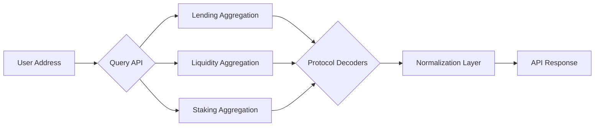

import PDFDownloadButton from '@site/src/components/PDFDownloadButton';

<div style={{ display: 'flex', justifyContent: 'flex-end', marginBottom: '2rem' }}>
  <PDFDownloadButton />
</div>

# Kixago Multi-Chain DeFi Aggregator API Whitepaper

## Executive Summary

Kixago provides developers with a **unified, normalized API for querying DeFi protocol state across multiple blockchains**, including Ethereum, Polygon, and Arbitrum. Our API handles:

- Protocol-specific decoding  
- Multi-chain aggregation  
- Normalized responses for lending, liquidity, and staking  

**Benefit:** Developers save **2–3 weeks of engineering** per integration and avoid maintaining custom adapters for 50+ protocols.

---

## Mission: Developer-First DeFi Protocol Aggregation

Our mission is to **empower developers** by providing a reliable, **real-time multi-chain DeFi protocol data layer**. Instead of integrating with dozens of APIs and handling protocol updates, developers query **one API** for complete positions, yields, and risk.

---

## Problem Statement: The Current Developer Challenge

### Current Layers

**Layer 1: RPC Providers** (Alchemy, Infura)  
- Raw blockchain data (eth_call, eth_getBalance)  
- No understanding of DeFi protocols  

**Layer 2: Protocol APIs/Subgraphs** (Aave API, Uniswap subgraph)  
- Each protocol is different  
- Each chain is different  
- Developers must integrate and normalize separately  

### Developer Pain Points

Example: "Show all USDC lending positions for address X across all chains"

**Current workflow:**

1. Call Aave API (Ethereum)  
2. Call Aave API (Polygon)  
3. Call Compound API (Ethereum)  
4. Call Compound API (Polygon)  
5. Parse different schemas  
6. Normalize data manually  
7. Handle failures individually  
8. Update as protocols upgrade  

**Time required:** 2–3 weeks

---

## Solution: Layer 2.5 Protocol Aggregation API

Kixago provides **one API call** for real-time positions:

```http
GET /api/v1/protocol-positions?address=0x1234&protocol=lending&token=USDC&include_all_chains=true
```

**Response:**

```json
[
  { "protocol": "aave", "chain": "ethereum", "amount": 100, "apy": 5.2, "ltv": 0.7 },
  { "protocol": "aave", "chain": "polygon", "amount": 50, "apy": 4.8, "ltv": 0.7 },
  { "protocol": "compound", "chain": "ethereum", "amount": 200, "apy": 4.2, "ltv": 0.65 },
  { "protocol": "morpho", "chain": "ethereum", "amount": 150, "apy": 5.5, "ltv": 0.75 }
]
```

**Developer benefit:** Complete, normalized data **in 5 minutes**.

---

## Competitive Differentiation

| Feature | Kixago | Covalent | The Graph | DefiLlama | RPC Providers |
|---------|--------|----------|-----------|-----------|---------------|
| Multi-chain queries | ✅ Yes | ✅ Partial | ❌ Fragmented | ✅ Yes | ❌ Single chain |
| Protocol position queries | ✅ Deep | ❌ Surface-level | ❌ No | ❌ No | ❌ No |
| Real-time state | ✅ Yes | ❌ Indexed | ❌ Indexed | ❌ Indexed | ✅ Real-time (raw) |
| Normalized responses | ✅ Yes | ⚠️ Partial | ❌ No | ⚠️ Partial | ❌ No |
| Developer-focused API | ✅ Yes | ⚠️ Partial | ⚠️ Partial | ❌ No | ✅ Yes (different purpose) |
| DeFi-specific logic | ✅ Yes | ❌ No | ❌ No | ⚠️ Limited | ❌ No |
| Owned infrastructure | ✅ Yes | ⚠️ Partial | ⚠️ Partial | ❌ No | ✅ Yes (not their focus) |

**Key Insight:** Kixago focuses narrowly and deeply on **real-time DeFi protocol state**, not just wallet balances or consumer dashboards.

---

## Technical Architecture



**Highlights:**

- Own nodes for Ethereum, Polygon, Arbitrum  
- Pre-built decoders for Aave, Compound, Morpho, Uniswap, Curve  
- Real-time data with sub-100ms latency  
- Normalized JSON schema across protocols/chains  

---

## MVP Roadmap

### Phase 1: Lending Aggregation (Weeks 1–6)

- **Endpoints:** `/lending/positions`, `/lending/opportunities`, `/lending/health-factor`  
- **Protocols:** Aave, Compound, Morpho  
- **Chains:** Ethereum, Polygon, Arbitrum  
- **Normalized schema:** APY, LTV, USD value, risk metrics  

### Phase 2: Liquidity & Staking Aggregation (Months 2–3)

- Endpoints for LP positions, staking rewards  
- **Protocols:** Uniswap, Curve, Balancer, Yearn  
- Expand chain coverage (Solana, Optimism, Base)  

### Phase 3: Advanced Yield & Risk Tools (Months 4+)

- Yield farming opportunities  
- Portfolio risk dashboards  
- Liquidation alerts  
- Historical tracking  

---

## Developer Use Cases

### 1. Liquidation Alert Bot

**Problem:** Monitor positions across chains for liquidation risk.

**Kixago Solution:** Single API returns:

```json
{
  "positions": [
    { 
      "protocol": "aave", 
      "chain": "ethereum", 
      "ltv_current": 0.45, 
      "ltv_liquidation_threshold": 0.8, 
      "health_factor": 1.78 
    },
    { 
      "protocol": "compound", 
      "chain": "polygon", 
      "ltv_current": 0.03, 
      "health_factor": 28.33 
    }
  ]
}
```

- Pre-calculated health factors  
- Time-to-liquidation estimates  
- Real-time monitoring  

**Time saved:** 2–3 hours vs 1–2 days manually

---

### 2. Yield Comparison Tool

**Problem:** Show users the best USDC yield across protocols/chains.

```json
[
  { "protocol": "morpho", "chain": "ethereum", "apy_real": 6.85, "risk_score": 0.2 },
  { "protocol": "aave", "chain": "ethereum", "apy_real": 5.1, "risk_score": 0.1 }
]
```

**Impact:** Developers ship apps faster; users earn higher yield with risk awareness.

---

### 3. Institutional Risk Dashboard

**Problem:** Monitor $10M portfolio across chains.

**Kixago Solution:** Aggregated risk scores:

```json
{
  "total_collateral_usd": 10000000,
  "total_borrowed_usd": 5000000,
  "weighted_health_factor": 2.1,
  "positions_at_risk": 0
}
```

- Single dashboard view  
- Actionable recommendations  
- Real-time liquidation alerts  

---

## Why Kixago is Uniquely Positioned

- **Deep protocol understanding** — decoding smart contract storage  
- **Real-time, multi-chain aggregation**  
- **Developer-first API** — actionable, normalized data  
- **Owned infrastructure** — independent of third-party RPC providers  

:::tip Key Differentiator
Covalent focuses on wallet/token balances; The Graph is fragmented; DefiLlama is consumer-first. Kixago is the **protocol aggregation layer for developers**.
:::

---

## Pricing & Go-to-Market

- **$49–299/month**, SaaS subscription  
- **Target early adopters:** DeFi tooling developers, bots, analytics platforms  
- **Wedge strategy:** Start with lending, expand to LPs and staking, then full multi-chain coverage  

---

## Conclusion

Kixago **solves a critical gap in the DeFi ecosystem** — providing real-time, normalized multi-chain DeFi data for developers, bots, and analytics platforms. By abstracting the complexity of multi-protocol, multi-chain integration, Kixago allows developers to **focus on building applications**, not custom adapters or data normalization layers.

### Key Takeaways

- **Time Savings:** Developers avoid 2–3 weeks of manual integration per protocol.  
- **Real-Time Data:** Aggregated and normalized positions, yields, and risk metrics across multiple chains.  
- **Developer-First:** API design prioritizes actionable, programmatic access to DeFi protocol state.  
- **Scalable Infrastructure:** Own nodes and protocol decoders ensure independence and reliability.  

---

*© 2025 Kixago, Inc. All rights reserved.*
